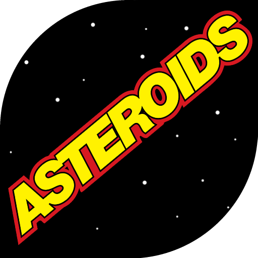
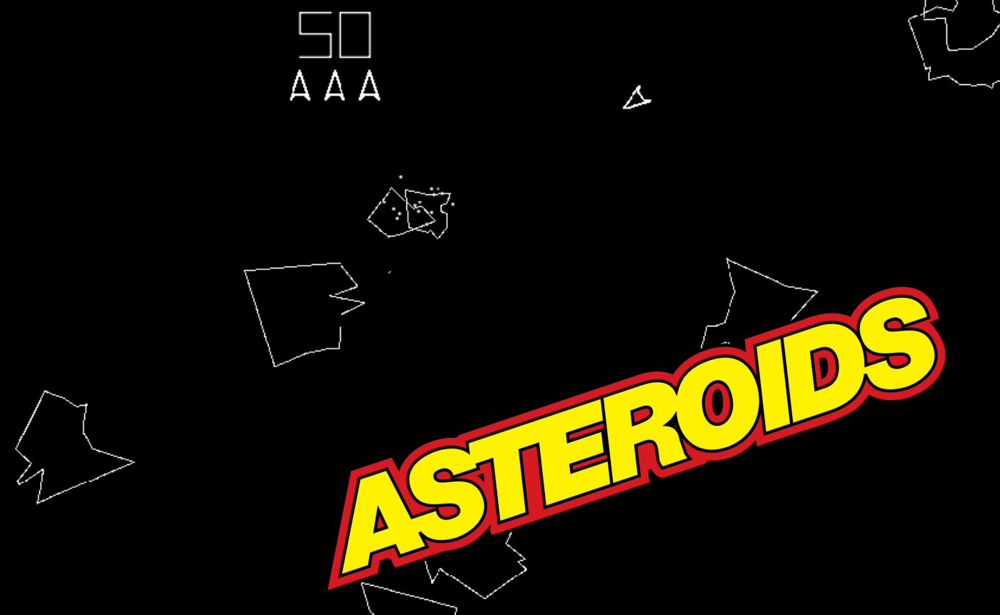
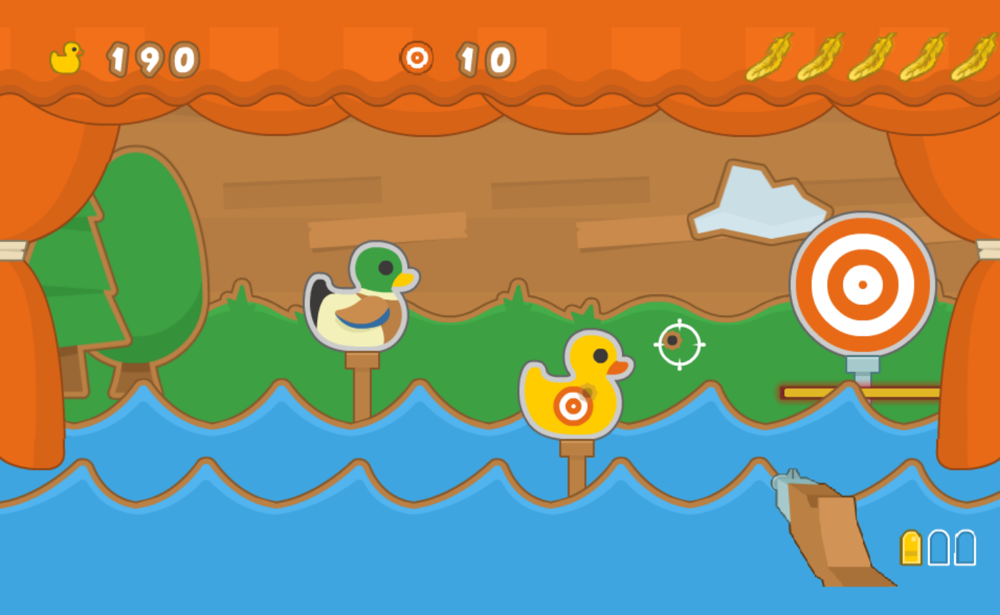

# Hi there 👋

> Hi, I'm **Leonardo🦁 Mimmo**, an aspiring Game Developer and 3D Artist from Italy 🇮🇹.  
> I love creating games, exploring Godot & Blender, and experimenting with 3D art and interactive experiences.  

- 🔭 I’m currently working on **Godot projects and 3D models**  
- 🌱 I’m learning **advanced game development, animation, and level design**  
- 👯 I’m looking to collaborate on **cool game projects**  
- 💬 Ask me about **Godot, Blender, 3D modeling, or programming**  
- 📫 How to reach me: **leoxmimmo@gmail.com**  
- ⚡ Fun fact: I integrate my own **pixel art style** into game projects  

---

### 🛠 languages and tools:

---

## 🎮 Projects

### Project 1: **ASTEROIDS** 

- Role: Indie Developer
- Tools: Godot, GDScript
- Description: A copy of famous arcade game with some features added.
- Demo: [Play Online](https://www.gamepix.com/it/play/asteroids)

---

### Project 2: **Duck shooter** 

- Role: Indie Developer
- Tools: Godot, GDScript
- Description: A fun shooting gallery where players aim at duck-shaped targets with rifle.
- Demo: [Play Online](https://www.gamepix.com/it/play/duck-shooter)

*(new progects and 3d games coming soon)*

---

## 📫 Contact Me

- Email: leoxmimmo@gmail.com  

---

*“Creating games is about turning imagination into playable experiences.”*
